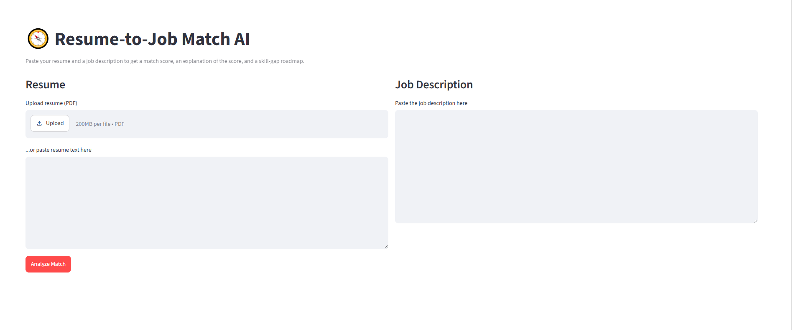
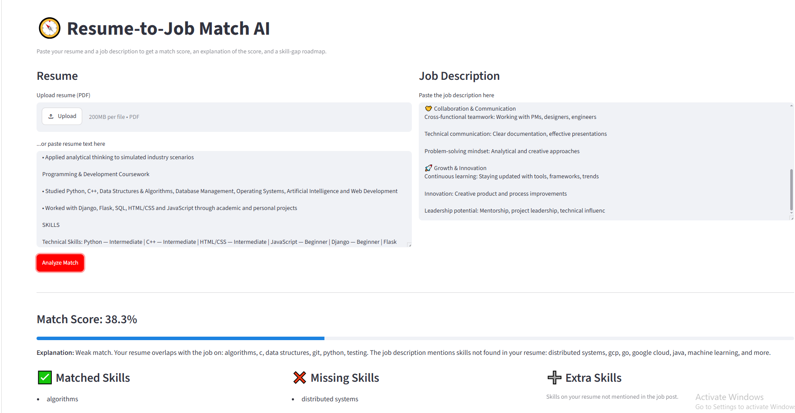

# 🧭 Resume-to-Job Match AI

An explainable AI tool that scores how well a resume matches a job description — and tells you *why*, plus what skills to learn next.


---

## ✨ Why this project stands out

Most "resume matcher" student projects do simple keyword counting. This one goes further:

- 🧠 **Semantic matching** — uses sentence embeddings (`sentence-transformers`), not just keyword overlap, to compute the core match score.
- 🔍 **Transparent skill extraction** — a rule-based layer on top of the embeddings, so every explanation is auditable, not a black box.
- 🗺️ **Skill-gap roadmap** — turns the analysis into concrete "learn this next" advice.
- 🌐 **Real web app** — ships as a working Streamlit app, not just a notebook.

---

## 📸 Screenshots

<!--
  Add your screenshots here! See the "Adding your own screenshots" section
  below for how to capture and embed them. Suggested shots:
  1. The empty app (resume + job description panels)
  2. A filled-in result showing the match score
  3. The skill-gap roadmap section
-->

| Home | Match Result |
|------|--------------|
|  |  |

---

## 🏗️ Architecture

```
                 ┌─────────────────┐
   Resume (PDF/  │                 │
   text) ───────►│  extract text   │
                 │  (pdfplumber)   │
                 └────────┬────────┘
                          │
   Job description ───────┼──────────────┐
   (text)                 │              │
                          ▼              ▼
                 ┌─────────────────────────────┐
                 │   sentence-transformers      │
                 │   embed_text() x2            │
                 └────────────┬─────────────────┘
                               │ cosine similarity
                               ▼
                     ┌───────────────────┐
                     │  Match Score (0-100)│
                     └───────────────────┘

                 ┌─────────────────────────────┐
   Resume/Job    │  Rule-based skill extraction │
   text ────────►│  (skills_db.py keyword match)│
                 └────────────┬─────────────────┘
                               │
                               ▼
                 ┌─────────────────────────────┐
                 │ matched / missing / extra    │
                 │ skills + explanation +       │
                 │ roadmap generation           │
                 └─────────────────────────────┘
                               │
                               ▼
                       Streamlit UI (app.py)
```

---

## 🚀 Getting Started

### 1. Clone the repo

```bash
git clone https://github.com/<your-username>/resume-match-ai.git
cd resume-match-ai
```

### 2. Create a virtual environment (recommended)

**Mac / Linux**
```bash
python3 -m venv venv
source venv/bin/activate
```

**Windows**
```bash
python -m venv venv
venv\Scripts\activate
```

### 3. Install dependencies

```bash
pip install -r requirements.txt
```

> This takes a few minutes the first time — `sentence-transformers` pulls in PyTorch.

### 4. Run the app

```bash
streamlit run app.py
```

If your browser doesn't open automatically, copy the **Local URL** printed in the terminal (usually `http://localhost:8501`) and paste it into your browser.

---

## 📂 Project Structure

```
resume_matcher/
├── app.py               # Streamlit web UI
├── matcher.py            # Core engine: embeddings, similarity, explanation, roadmap
├── skills_db.py           # Curated skill list used for extraction
├── requirements.txt        # Dependencies
├── screenshots/              # App screenshots for this README
└── README.md
```

---

## 🖼️ Adding your own screenshots

1. Run the app locally (`streamlit run app.py`) and use it in your browser.
2. Take a screenshot:
   - **Windows:** `Win + Shift + S`, select the app window, save as PNG.
   - **Mac:** `Cmd + Shift + 4`, drag to select the app window.
   - **Linux:** use your screenshot tool (e.g. `gnome-screenshot -a`).
3. Save the files into the `screenshots/` folder in this repo — e.g. `screenshots/home.png` and `screenshots/result.png`.
4. Commit and push:
   ```bash
   git add screenshots/
   git commit -m "Add app screenshots"
   git push
   ```
5. They'll automatically show up in the table under **📸 Screenshots** above once pushed to GitHub.

---

## 🔮 Ideas to extend further

- Swap the rule-based explanation for an LLM call (OpenAI/Anthropic/local model) for richer, more natural explanations.
- Add a vector database (FAISS/Chroma) to match one resume against *many* job postings at once.
- Use NER models (e.g. spaCy `en_core_web_trf`) instead of keyword matching for more robust skill extraction.
- Add authentication + history to track match-score improvement over time.
- Deploy on **Streamlit Community Cloud** (free) and link the live app on your resume/LinkedIn.

---

## 📝 License

MIT — free to use and modify for your own projects.
